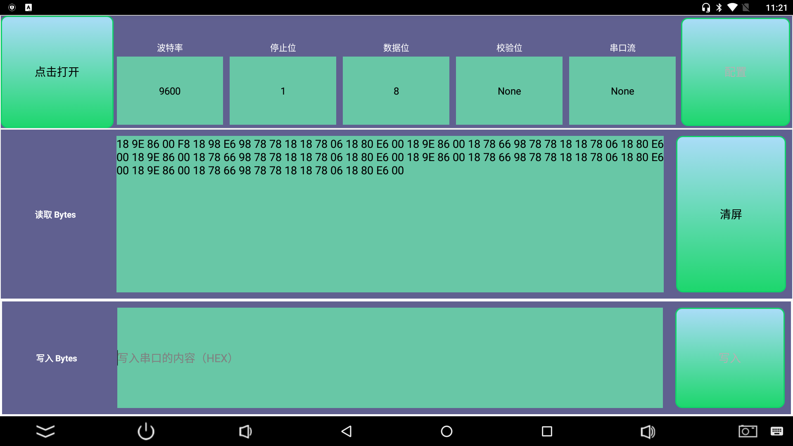

# CH340/CH341的USB转串口安卓免驱应用库

### 在原版的基础上修复bug，优化代码
1. 修复：退出时，读取线程未关闭的bug
2. 新增USB断开监听回调
3. 读取数据后采用回调给前端，而不是之前的死循环
3. 采用java8
4. 支持到android12
5. demo启用dataBinding，而不再使用findViewById
6. 优化代码逻辑，使得更容易理解和使用
7. 新增大量注释（中文）
8. 更新UI布局和颜色调整


## 引用

### [子module添加依赖，当前最新版：————> 1.0.0　　　　](https://search.maven.org/artifact/com.kotlinx/CH34xUART)

```
dependencies {
    //更新地址  https://github.com/yutils/CH34xUART 建议过几天访问看下有没有新版本
    implementation 'com.kotlinx:CH34xUART:1.0.0'
}
```

注：如果引用失败，或者工程未引入mavenCentral，请引入：mavenCentral()
```
allprojects {
    repositories {
        mavenCentral()
        //阿里云等...
    }
}
```

# 使用方法

可以参考MainActivity.java


### 界面截图
  

**[releases里面有APK文件。点击前往](https://github.com/yutils/CH34xUART/releases)**

感谢：[CH34xUART](https://github.com/HeHongdan/CH34xUART) ，[CH340/CH341的USB转串口安卓免驱应用库](http://www.wch.cn/download/CH341SER_ANDROID_ZIP.html)

如果调用安卓原生串口，请参考这个工程：  
[YSerialPort](https://github.com/yutils/YSerialPort)